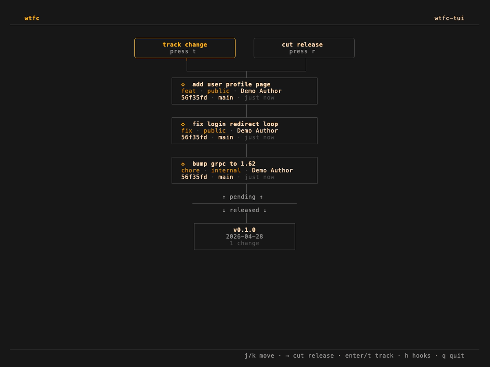

# wtfc
 
> **W**ork, **T**rack, **F**ormat, **C**hangelog. A schema-driven changelog tool with a TUI, CLI, and MCP server.

`wtfc` lets you queue structured changes per project, then collapse them into an authoritative `changelog.json` at release time. Everything downstream — `CHANGELOG.md`, RSS feeds, Slack posts, deploy hooks — derives from that one file.

Three ways in: a centered-timeline TUI, a scriptable CLI, and an MCP server so AI agents can drive the same flow first-party. All three enforce the same schema rules.

---

## TUI



A vertical-timeline view of your project: a fork at the top for `track change` / `cut release`, the queued pending changes below it, a labelled `pending ↑ / ↓ released` divider, and shipped releases descending into history.

| Key                | Action                                              |
| ------------------ | --------------------------------------------------- |
| `j/k` or `↑/↓`     | Move cursor between timeline nodes                  |
| `←/→`              | Switch between fork medallions (track ↔ cut)        |
| `enter`            | Context-sensitive: open form, expand release, edit  |
| `t`                | Track a change (modal form)                         |
| `r`                | Cut a release (modal form)                          |
| `e`                | Edit focused pending change                         |
| `d`                | Delete focused pending change                       |
| `u`                | Unrelease the newest release (with confirmation)    |
| `h`                | Hooks screen                                        |
| `q`                | Quit                                                |

Forms render as a centered modal over a dimmed timeline backdrop. Toast notifications appear bottom-right and auto-dismiss after a few seconds.

---

## CLI


```sh
wtfc init                                       # scaffold wtfc/ in cwd
wtfc change --field summary="…" --field type=feat
wtfc change show <id>                           # one record by UUID/prefix
wtfc change edit <id> --field audience=public   # partial-update merge
wtfc change rm <id>                             # delete by UUID/prefix
wtfc list                                       # tabular pending changes
wtfc release v0.2.0 --field notes="…"           # collapse pending → changelog
wtfc unrelease                                  # restore last release to pending
wtfc history                                    # released versions, newest first
wtfc schema --json                              # emit schema as JSON
wtfc help
```

`--field key=value` is repeatable; `--json '{...}'` accepts a typed JSON blob. Combine them — `--field` overrides on collision.

---

## MCP server


`wtfc` ships an [MCP](https://modelcontextprotocol.io) server so agent hosts (Claude Code, Claude Desktop, Cursor, Zed, …) drive the change flow first-party. The agent sees your schema, proposes a structured change, the host shows it to you for approval, then commits.

### What it looks like in a host


Real [Claude Code](https://claude.com/product/claude-code) session — the agent calls `get_schema` → `propose_change`, shows the record (with `author`/`commit`/`branch` already auto-filled from the project's git context), waits for confirmation, then calls `create_change`. The propose preview reflects exactly what create will write, so the agent doesn't have to guess at fields the schema can fill on its own.

### Setup

**Claude Code:**
```sh
claude mcp add wtfc -- wtfc mcp
```

**Claude Desktop** — edit `~/Library/Application Support/Claude/claude_desktop_config.json`:
```json
{
  "mcpServers": {
    "wtfc": { "command": "wtfc", "args": ["mcp"] }
  }
}
```
Restart the app.

**Test without a host** — use the official inspector:
```sh
npx @modelcontextprotocol/inspector wtfc mcp
```

### Tools exposed

| Tool                   | What it does                                                   |
| ---------------------- | -------------------------------------------------------------- |
| `get_schema`           | Returns the changeset and release schemas. Call this first.    |
| `list_pending_changes` | Pending changes queued for the next release.                   |
| `propose_change`       | Build a change record without writing — for human preview.     |
| `create_change`        | Write the change file. Hosts may require confirmation.         |
| `update_change`        | Merge field updates into an existing change. Preserves id.     |
| `delete_change`        | Remove a pending change by id (UUID or unique prefix).         |

Every tool accepts an optional `project_path` argument — set it explicitly so the server knows which `wtfc/config.toml` to use, regardless of where the host launched it from.

The server publishes top-level **instructions** that guide agents through the canonical flow: `get_schema` → `propose_change` → user confirms → `create_change`. `update_change` is preferred over delete-and-recreate when adjusting fields.

Releases and unreleases are intentionally **not** exposed via MCP. Those are human decisions; the agent stops at queuing changes.

---

## Schema

`wtfc/config.toml` defines the fields on a changeset and a release. The schema is additive — adding fields later doesn't break old data — and `required = true` is enforced uniformly from the TUI, CLI, and MCP server.

```toml
[changeset]
fields = [
  { name = "summary",  type = "string", required = true },
  { name = "type",     type = "enum",   values = ["feat", "fix", "chore"], required = true },
  { name = "audience", type = "list",   values = ["public", "internal"] },
]

[release]
fields = [
  { name = "notes",    type = "string" },
  { name = "audience", type = "list",   values = ["public", "internal"] },
]
```

Field types: `string`, `bool`, `int`, `enum` (single value from `values`), `list` (subset of `values`).

### Auto-fill sources

A field can declare a `source` to auto-populate itself when the user doesn't provide a value. Resolution runs at the write boundary so every entry point — TUI form, CLI flag, MCP tool — gets the same behavior. User-supplied values always win.

```toml
[changeset]
fields = [
  { name = "summary", type = "string", required = true },
  { name = "type",    type = "enum",   values = ["feat","fix","chore"], required = true },
  { name = "author",  type = "string", source = "git.user" },
  { name = "commit",  type = "string", source = "git.sha" },
  { name = "branch",  type = "string", source = "git.branch" },
]
```

Built-in sources:

| Name          | Resolves to                                    |
| ------------- | ---------------------------------------------- |
| `git.user`    | `git config user.name`                         |
| `git.email`   | `git config user.email`                        |
| `git.sha`     | `git rev-parse HEAD`                           |
| `git.branch`  | `git rev-parse --abbrev-ref HEAD` (skips detached HEAD) |
| `system.user` | `$USER` (or `$USERNAME` on Windows)            |

If a source can't resolve (no git, not in a repo, no `user.name`), the slot stays empty and the normal `required` validation handles whether that's an error.

Release fields work the same way — declare `commit = "git.sha"` on the release schema and every cut release is stamped with its HEAD.

---

## Hooks

Hooks turn `changelog.json` into anything else — `CHANGELOG.md`, an RSS feed, a Slack post, a deploy trigger. wtfc owns the trigger; you own the logic.

There's one event: **`on-release-changed`**. It fires after both `wtfc release` and `wtfc unrelease`, with the full Changelog JSON on stdin. The `WTFC_OP` env var tells you which one (`release` or `unrelease`) so a single script can branch if needed.

```sh
mv wtfc/hooks/on-release-changed.sample wtfc/hooks/on-release-changed
chmod +x wtfc/hooks/on-release-changed
```

The scaffolded sample regenerates `CHANGELOG.md` from full release history every time it fires — idempotent under both directions. It groups changes by type (Features → Fixes → Chores → Other), prints a per-release meta line summarising change-count and contributors, and stamps each entry with its author and short commit when those fields are populated:

~~~markdown
## v0.2.0 — 2026-04-29

> 3 changes · by Joel Huggett · `7c8d750`

### Features

- add user profile page  
  <sub>Joel Huggett · `7c8d750`</sub>

### Fixes

- fix login redirect loop <kbd>internal</kbd>  
  <sub>Joel Huggett · `7c8d750`</sub>
~~~

See [`CHANGELOG.md`](./CHANGELOG.md) — wtfc dogfoods this hook on its own release history.

| Env var               | Value                                                   |
| --------------------- | ------------------------------------------------------- |
| `WTFC_EVENT`          | `on-release-changed`                                    |
| `WTFC_OP`             | `release` or `unrelease`                                |
| `WTFC_RELEASE_NAME`   | Name of the affected release                            |
| `WTFC_PROJECT_ROOT`   | Project root (parent of `wtfc/`)                        |
| `WTFC_DIR`            | The `wtfc/` directory                                   |
| `WTFC_CHANGELOG_PATH` | Absolute path to `changelog.json`                       |
| `WTFC_PENDING_DIR`    | Absolute path to `wtfc/pending/`                        |

A non-zero exit aborts wtfc with status 1; the underlying mutation stays committed (the changelog is authoritative).

---

## Install

**Homebrew** (macOS / Linux) — recommended:

```sh
brew install jhuggett/tap/wtfc
brew upgrade wtfc          # later, when a new release lands
```

**Pre-built binary** — if you can't or don't want to use brew. Pick the archive for your platform from the [latest release](https://github.com/jhuggett/wtfc/releases/latest) and drop the binary on your `$PATH`:

```sh
curl -L https://github.com/jhuggett/wtfc/releases/latest/download/wtfc_$(uname -s | tr '[:upper:]' '[:lower:]')_$(uname -m | sed 's/x86_64/amd64/').tar.gz | tar -xz
mv wtfc /usr/local/bin/    # or anywhere on $PATH
```

**Go** — for Go users who already have `$GOBIN` set up:

```sh
go install github.com/jhuggett/wtfc@latest
```

**From source**:

```sh
git clone https://github.com/jhuggett/wtfc && cd wtfc
make install               # go install into $GOBIN / $GOPATH/bin
# or:
make build                 # ./bin/wtfc
```

---

## Project layout

```
.
├── main.go                       CLI dispatcher
├── mcp.go                        MCP server — tools + workflow instructions
├── internal/
│   ├── change/                   Change struct, Apply, Validate, Write, FindByID
│   ├── config/                   Schema (Field, Section), Validate, Load/FindUp
│   ├── hook/                     Hook runner + scaffold sample
│   ├── release/                  Release/Changelog, Cut, Unrelease, Load/Save
│   └── tui/                      Bubbletea TUI
│       ├── tui.go                Model, screens, header/footer, modals
│       └── timeline.go           Centered-spine timeline rendering
├── demos/                        VHS tape files + setup script for the GIFs
└── wtfc/                         The tool's own change tracking (dogfood)
    ├── config.toml
    ├── pending/
    └── hooks/on-release-changed
```

---

## Regenerating the demos

```sh
make install
vhs demos/cli.tape
vhs demos/tui.tape
vhs demos/mcp.tape
```
